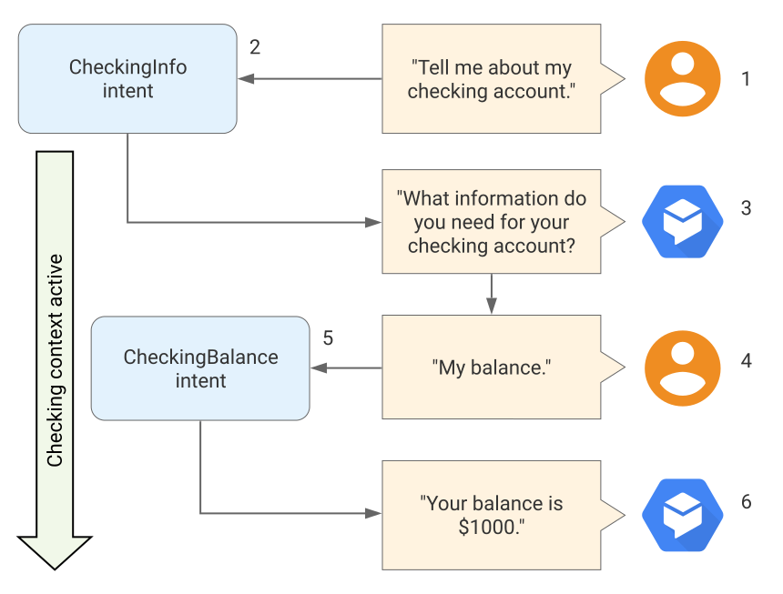

# Contexts

OpenNLU contexts are similar to natural language context. If a person says to you `they are orange`, you need context in order to understand what `they` is referring to. Similarly, for OpenNLU to handle an end-user expression like that, it needs to be provided with context in order to correctly match an intent.

Using contexts, you can control the flow of a conversation. You can configure contexts for an intent by setting [input and output contexts](#input-and-output-contexts), which are identified by string names. When an intent is matched, any configured output contexts for that intent become active. While any contexts are active, OpenNLU is more likely to match intents that are configured with input contexts that correspond to the currently active contexts.

The following diagram shows an example that uses context for a banking agent.

1. The end-user asks for information about their checking account.
   
2. OpenNLU matches this end-user expression to the CheckingInfo intent. This intent has a checking output context, so that context becomes active.

3. The agent asks the end-user for the type of information they want about their checking account.

4. The end-user responds with `my balance`.

5. OpenNLU matches this end-user expression to the CheckingBalance intent. This intent has a checking input context, which needs to be active to match this intent. A similar SavingsBalance intent may also exist for matching the same end-user expression when a savings context is active.

6. After your system performs the necessary database queries, the agent responds with the checking account balance.

## Input and Output Contexts

Input and output contexts are applied to intents. They work together to control conversation flow:

- **Output contexts** control active contexts. When an intent is matched, any configured output contexts for that intent become active.

- **Input contexts** control intent matching. While contexts are active, OpenNLU is more likely to match intents that are configured with input contexts that are a subset of currently active contexts.

With contexts, you can:

- Control the order of intent matching.

- Create context-specific intents with the same training phrases.

For example, consider the following intents:

| Intent name     | Training phrases          | Parameters | Input contexts | Output contexts | Response                               |
|-----------------|---------------------------|------------|----------------|-----------------|----------------------------------------|
| pet-init        | `What do they look like?` | -          | -              | -               | `What kind of pet do you like?`        |
| pet-select-dogs | `I like dogs`             | -          | -              | dogs            | `What do you want to know about dogs?` |
| pet-select-cats | `I like cats`             | -          | -              | cats            | `What do you want to know about cats?` |
| dog-show        | `What do they look like?` | -          | dogs           | -               | `Here is a picture of a dog.`          |
| cat-show        | `What do they look like?` | -          | cats           | -               | `Here is a picture of a cat.`          |

When the end-user says  `I like dogs`:

-   The  `pet-select-dogs`  intent is matched.
-   The output context is  `dogs`, so it becomes the active context.

When the end-user says  `I like cats`:

-   The  `pet-select-cats`  intent is matched.
-   The output context is  `cats`, so it becomes the active context.

When the end-user says  `What do they look like?`:

-   If  `dogs`  is the active context:
    -   The  `dog-show`  intent is matched.
    -   The end-user is shown a dog picture.
-   If  `cats`  is the active context:
    -   The  `cat-show`  intent is matched.
    -   The end-user is shown a cat picture.
-   If there is no active context:
    -   The  `pet-init`  intent is matched.
    -   The end-user is asked what kind of pet they like.

## Output Contexts

Multiple output contexts can be applied to an intent. When an intent is matched, any output contexts applied to the intent become active.

### Parameter references for active contexts

When an intent with output context is matched, its collected parameter values can serve as temporary storage with parameter references for active contexts. These values can be accessed during future intent matching, for as long as the context remains active.

For example, consider the following variation of the pet example above:

| Intent name | Training phrases             | Parameters | Input contexts | Output contexts | Response                                  |
|-------------|------------------------------|------------|----------------|-----------------|-------------------------------------------|
| `pet-init`  | `What do they look like?`    | -          | -              | -               | `What kind of pet do you like?`           |
| `pet-select`| `I like dogs`, `I like cats` | `pet`      | -              | `pet-chosen`    | `What do you want to know about $pet?`    |
| `pet-show`  | `What do they look like?`    | -          | `pet-chosen`   | -               | `Here is a picture of a #pet-chosen.pet.` |
| `dog-show`  | `What do they look like?`    | -          | `dogs`         | -               | `Here is a picture of a dog.`             |
| `cat-show`  | `What do they look like?`    | -          | `cats`         | -               | `Here is a picture of a cat.`             |

When the end-user says  `I like dogs`  or  `I like cats`:

-   The  `pet-select`  intent is matched.
-   The  `pet`  [parameter](actions-and-parameters.md)  is set to the chosen pet type.
-   The output context is  `pet-chosen`, so it becomes the active context.

When the end-user says  `What do they look like?`:

-   If  `pet-chosen`  is the active context:
    -   The  `pet-show`  intent is matched.
    -   If the end-user selected  `dogs`  in the prior conversational turn, the end-user is shown a dog picture.
    -   If the end-user selected  `cats`  in the prior conversational turn, the end-user is shown a cat picture.
-   If there is no active context:
    -   The  `pet-init`  intent is matched.
    -   The end-user is asked to select a pet type.

### Lifespan

Each active context has a lifespan that defines the number of conversational turns for which the context remains active. The default lifespan is five conversational turns for normal intents and two conversational turns for follow-up intents. You can override the default lifespan for any contexts. In addition, all contexts expire after 20 minutes of becoming active. When an intent is matched with an output context that is already active, the lifespan and expiration timer are reset.

For example, consider the following intent descriptions for a pet information agent:

| Intent name | Training phrases                                                           | Parameters | Input contexts | Output contexts             | Response                                                                 |
|-------------|----------------------------------------------------------------------------|------------|----------------|-----------------------------|--------------------------------------------------------------------------|
| pet-init    | `What do they look like?`, `What do they sound like?`, `How big are they?` | -          | -              | -                           | `What kind of pet do you like?`                                          |
| pet-select  | `I like dogs`, `I like cats`                                               | `pet`      | -              | `pet-chosen` (lifespan = 2) | `What do you want to know about $pet?`                                   |
| pet-show    | `What do they look like?`                                                  | -          | `pet-chosen`   | -                           | `Here is a picture of a #pet-chosen.pet. What else do you want to know?` |
| pet-audio   | `What do they sound like?`                                                 | -          | `pet-chosen`   | -                           | `Here is a #pet-chosen.pet sound. What else do you want to know?`        |
| pet-size    | `How big are they?`                                                        | -          | `pet-chosen`   | -                           | `Here is a #pet-chosen.pet size chart. What else do you want to know?`   |

The following table shows an example dialogue for this pet information agent, which illustrates the lifespan of the `pet-chosencontext`:

| Turn | Dialog                                                                                          | Explanation                                                                                                                |
|------|-------------------------------------------------------------------------------------------------|----------------------------------------------------------------------------------------------------------------------------|
| 1    | Agent: What kind of pet do you like?                                                            | The `pet-init` intent is matched.                                                                                            |
| 2    | User: I like cats. Agent: What do you want to know about cats?                                  | The `pet-select` intent is matched. The pet-chosen output context becomes the active context.                                |
| 3    | User: What do they look like? Agent: Here is a picture of a cat. What else do you want to know? | The `pet-show` intent has a pet-chosen input context, so it is matched. The pet-chosen context has been active for 1 turn.   |
| 4    | User: What do they sound like? Agent: Here is a cat sound. What else do you want to know?       | The `pet-audio` intent has a pet-chosen input context, so it is matched. The pet-chosen context has been active for 2 turns. |
| 5    | User: How big are they? Agent: What kind of pet do you like?                                    | The `pet-init` intent is matched again, because the pet-chosen context is no longer active.                                  |

## Input Contexts

While contexts are active, OpenNLU is more likely to match intents that are configured with input contexts that correspond to the currently active contexts. The detailed intent matching rules are as follows:

1.  An intent's input context list must be a subset of the currently active context list in order to be matched. This also applies to intents with no input contexts.
2.  For intents that satisfy rule #1, those with an input context list that most closely match the currently active context list are more likely to be matched.

For example:

-   Intents with no input contexts can be matched at any time.
-   When no contexts are active, only intents with no input contexts can be matched.
-   If contexts `A` and `B` are active, an intent with `A` and `C` input contexts cannot be matched.
-   If contexts `A`, `B`, and `C` are active, an intent with `A` and `B` input contexts can be matched.
-   If contexts `A` and `B` are active, an intent with `A` and `B` input contexts is more likely to be matched than an intent with no input context or an intent with just `A` for an input context.