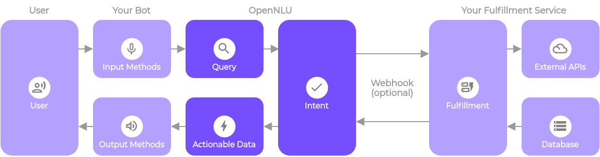

# Fulfillment

By default, your agent responds to a matched intent with a static response. If you're using one of the integration options, you can provide a more dynamic response by using fulfillment. When you enable fulfillment for an intent, OpenNLU responds to that intent by calling a service that you define. For example, if an end-user wants to schedule a haircut on Friday, your service can check your database and respond to the end-user with availability information for Friday.

Each intent has a setting to enable fulfillment. If an intent requires some action by your system or a dynamic response, you should enable fulfillment for the intent. If an intent without fulfillment enabled is matched, OpenNLU uses the static response you defined for the intent.

When an intent with fulfillment enabled is matched, OpenNLU sends a request to your webhook service with information about the matched intent. Your system can perform any required actions and respond to OpenNLU with information for how to proceed. The following diagram shows the processing flow for fulfillment.

1.  The end-user types or speaks an expression.

2.  OpenNLU matches the end-user expression to an intent and extracts parameters.

3.  OpenNLU sends a webhook request message to your webhook service. This message contains information about the matched intent, the action, the parameters, and the response defined for the intent.

4.  Your service performs actions as needed, like database queries or external API calls.

5.  Your service sends a webhook response message to OpenNLU. This message contains the response that should be sent to the end-user.

6.  OpenNLU sends the response to the end-user.

7.  The end-user sees or hears the response.