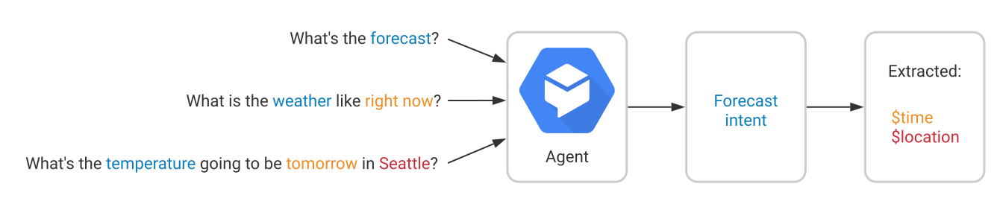
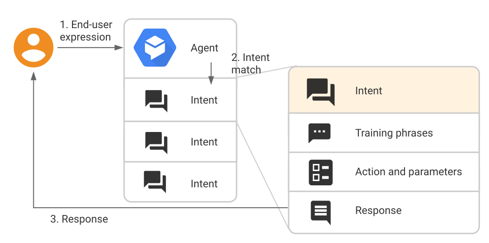

# Intents

An intent categorizes an end-user's intention for one conversation turn. For each agent, you define many intents, where your combined intents can handle a complete conversation. When an end-user writes or says something, referred to as an end-user expression, OpenNLU matches the end-user expression to the best intent in your agent. Matching an intent is also known as intent classification.

For example, you could create a weather agent that recognizes and responds to end-user questions about the weather. You would likely define an intent for questions about the weather forecast. If an end-user says `What's the forecast?`, OpenNLU would match that end-user expression to the forecast intent. You can also define your intent to extract useful information from the end-user expression, like a time or location for the desired weather forecast. This extracted data is important for your system to perform a weather query for the end-user.

A basic intent contains the following:

- [User Says](#user-says): These are example phrases for what end-users might say. When an end-user expression resembles one of these phrases, OpenNLU matches the intent. You don't have to define every possible example, because OpenNLU's built-in machine learning expands on your list with other, similar phrases.

- [Action](#action): You can define an action for each intent. When an intent is matched, OpenNLU provides the action to your system, and you can use the action to trigger certain actions defined in your system.

- [Parameters](#parameters): When an intent is matched at runtime, OpenNLU provides the extracted values from the end-user expression as parameters. Each parameter has a type, called the [entity type](entities.md), which dictates exactly how the data is extracted. Unlike raw end-user input, parameters are structured data that can easily be used to perform some logic or generate responses.

- [Responses](#responses): You define text, speech, or visual responses to return to the end-user. These may provide the end-user with answers, ask the end-user for more information, or terminate the conversation.

A more complex intent may also contain the following:

- [Contexts](#contexts): OpenNLU contexts are similar to natural language context. If a person says to you `they are orange`, you need context in order to understand what the person is referring to. Similarly, for OpenNLU to handle an end-user expression like that, it needs to be provided with context in order to correctly match an intent.

## User Says

Training phrases are example phrases for what end-users might type or say, referred to as end-user expressions. For each intent, you create many training phrases. When an end-user expression resembles one of these phrases, OpenNLU matches the intent.

For example, the training phrase `I want pizza` trains your agent to recognize end-user expressions that are similar to that phrase, like `Get a pizza` or `Order pizza`.

You don't have to define every possible example, because OpenNLU's built-in machine learning expands on your list with other, similar phrases. You should create at least 10-20 (depending on complexity of intent) training phrases, so your agent can recognize a variety of end-user expressions. For example, if you want your intent to recognize an end-user's expression about their favorite color, you could define the following training phrases:

- `I like red`
- `My favorite color is yellow`
- `black`
- `Blue is my favorite`
...
  
## Action

The action field is a simple convenience field that assists in executing logic in your service.

When building an agent, you can set this field to any text you find useful.

When an intent is matched at runtime, OpenNLU provides the action value to your fulfillment webhook request or the API interaction response. It can be used to trigger specific logic in your service.

## Parameters

When an intent is matched at runtime, OpenNLU provides the extracted values from the end-user expression as parameters. Each parameter has a type, called the entity type, which dictates exactly how the data is extracted. Unlike raw end-user input, parameters are structured data that can easily be used to perform some logic or generate responses.

See the [actions and parameters](actions-and-parameters.md#parameters) references.

## Responses

Intents have a built-in response handler that can return responses after the intent is matched. This feature only supports static responses, though you can use [parameter references](#parameters) in these responses to make them somewhat dynamic. This is helpful for recapping information provided by the end-user. For example, your intent response could look like: `Okay, I booked a room for you on $date`.

In some cases, this is all you need. In cases where your code needs to take some action or build a more dynamic response, you should use one of the dynamic response options below. Agents typically use a combination of static and dynamic responses.

Multiple types of responses can be provided. The basic response type is a text response. Other types of responses are available (image, audio, synthesized speech, and so on), some of which are platform-specific.

If you define more than one response variation for an intent, your agent will select a response at random. You should add several response variations to make your agent more conversational.

When building an agent, you should provide response data for each intent. When you use the API or [fulfillment](fulfillment.md) to interact with OpenNLU, you technically may not need to provide response data, because both of these methods can dynamically generate any response. However, if you want to use the simulator for testing or define intents that have a simple response, you should provide response data.

As a general rule, your intent responses should prompt the end-user to provide an expression that will match another intent. Your responses should also guide the end-user to provide specific data. For example, a question like `What city were you born in?` is better than a more open-ended question like `Where were you born?`.

## Contexts

OpenNLU contexts are similar to natural language context. If a person says to you "they are orange", you need context in order to understand what "they" is referring to. Similarly, for OpenNLU to handle an end-user expression like that, it needs to be provided with context in order to correctly match an intent.

See the [contexts](contexts.md) references.